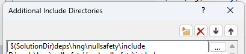

# nullsafety
C++20 header only library for null safety utilities.

# Features
- `notnull<TPointer>` pointer wrapper class that throws an exception when constructed from null. (`notnull` is copyable but not movable; see [Description](#notnull) section below.)
- `derefnullchecked<TPointer>` pointer wrapper class that throws an exception when null dereferenced.
- `nullptr_error` exception class
- `throw_if_null(pointer)`
- `as_span_of_derefnullchecked(span<TPointer>) -> span<derefnullchecked<TPointer>>`
- `as_span_of_notnull(span<TPointer>) -> span<notnull<TPointer>>` - throws an exception if any element pointer is null.
- Works with smart pointers, for example `notnull<std::shared_ptr<T>>`
- Works with falsy value types, for example `notnull<int>` ensures that the int is not 0.

# Installation
This is a header only library. Copy the file `hng/nullsafety/include/hng/nullsafety/nullsafety.h` into your project dependencies.

For example, in Visual Studio on Windows

1. Create a new C++ console application.

2. In the Solution Explorer, right click the C++ project | Properties | C/C++ | Additional Include Directories | &lt;Edit...&gt;

    

3. Add the `include` folder.

    ```
    $(SolutionDir)deps\hng\nullsafety\include
    ```

    

4. Include the header file.

    ```cpp
    #include <iostream>
    #include <assert>
    #include <hng/nullsafety/nullsafety.h>

    int main() {
        int x = 2;
        int* y = &x;
        hng::nullsafety::notnull<int*> p = y;
        std::cout << *p << std::endl;
        // ^ prints "2".

        //p = nullptr;
        // ^ will not compile.

        p = static_cast<int*>(nullptr);
        // ^ throws a hng::nullsafety::nullptr_error at runtime, p is unchanged.

        hng::nullsafety::notnull p2 = static_cast<int*>(nullptr);
        // ^ throws a hng::nullsafety::nullptr_error at runtime.

        hng::nullsafety::derefnullchecked<int*> q = nullptr;
        // ^ ok

        *q = 5;
        // ^ throws a hng::nullsafety::nullptr_error at runtime.

        std::cout << *p << std::endl;
    }
    ```

# Description

## notnull

The `notnull<P>` class invariant guarantees that the inner value is not falsy. A value is falsy if it is converted to the bool value `false` when evaluated in a boolean context, such as the condition of an if statement ( `if(b)` ) or ternary operator ( `b ? x : y` ).

If `P` is a pointer-like type, then the notnull class invariant guarantees that the inner pointer is not null, because of the assumption that if the pointer value is null then it is falsy.

Scenarios involving thread safety issues or `const_cast` are out of scope for the guarantees this class provides.

Note: `notnull` uses a copy constructor instead of a move constructor, because moving ownership of a smart pointer (`std::unique_ptr<T>`, `std::shared_ptr<T>`) would leave the original pointer empty. Consider using `derefnullchecked` instead of `notnull` if you want to do more than just keep it in a variable until end of scope, like return it from a function.

## derefnullchecked

The `derefnullchecked<P>` class is nullable, but the pointer is checked for null when it is dereferenced using the `*` or `->` operators
which may throw a `nullptr_error` exception (instead of causing undefined behaviour).
Unlike `notnull`, `derefnullchecked` is default constructible and move constructible, which means it can be returned from functions.

# Running the Tests

```
cd build/
cmake ..
```

2. Open the Visual Studio solution `.sln` that was generated at `build/nullsafety_tests.sln`.

3. In the Solution Explorer, right click `nullsafety_tests` | Set as Startup Project

4. Debug | Start Debugging (F5)
