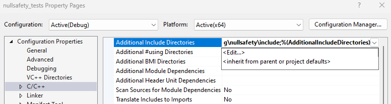

# nullsafety
C++20 header only library for null safety utilities - notnull, derefchecked

# Installation
This is a header only library. Copy the file `hng/nullsafety/include/hng/nullsafety/nullsafety.h` into your project dependencies.

For example, in Visual Studio on Windows

1. Create a new C++ console application.

2. In the Solution Explorer, right click the C++ project | Properties | C/C++ | Additional Include Directories | &lt;Edit...&gt;

    

3. Add the `include` folder.

    ```
    $(SolutionDir)deps\hng\nullsafety\include
    ```

    

4. Include the header file.

    ```cpp
    #include <iostream>
    #include <assert>
    #include <hng/nullsafety/nullsafety.h>

    int main() {
        int x = 2;
        int* y = &x;
        hng::nullsafety::notnull<int*> p = y;
        std::cout << *p << std::endl;
        // ^ prints "2".

        //p = nullptr;
        // ^ will not compile.

        p = static_cast<int*>(nullptr);
        // ^ throws a hng::nullsafety::nullptr_error at runtime, p is unchanged.

        hng::nullsafety::notnull p2 = static_cast<int*>(nullptr);
        // ^ throws a hng::nullsafety::nullptr_error at runtime.

        hng::nullsafety::derefchecked<int*> q = nullptr;
        // ^ ok

        *q = 5;
        // ^ throws a hng::nullsafety::nullptr_error at runtime.

        std::cout << *p << std::endl;
    }
    ```

# Running the Tests

```
cd build/
cmake ..
```

2. Open the Visual Studio solution `.sln` that was generated at `build/nullsafety_tests.sln`.

3. In the Solution Explorer, right click `nullsafety_tests` | Set as Startup Project

4. Debug | Start Debugging (F5)
